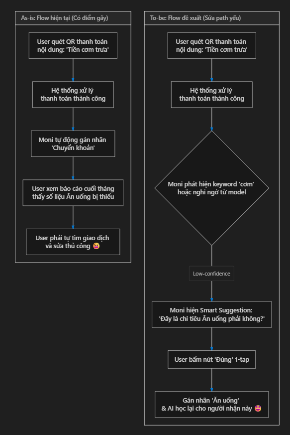

# Bài Lab: Mổ App AI Thật - MoMo Moni

**App được chọn:** MoMo (Tính năng Moni - Trợ thủ tài chính, phân tích chi tiêu)

## 1. Dùng thử: Promise vs Reality
- **Product hứa gì?** Giúp người dùng quản lý tài chính cá nhân, tự động theo dõi, phân loại chi tiêu và giải đáp các thắc mắc về dòng tiền qua chatbot.
- **User nào được hứa sẽ được giúp?** Những người dùng ví MoMo muốn kiểm soát thu chi nhưng lười ghi chép sổ sách thủ công.
- **Kỳ vọng AI làm được task nào?** Tự động phân loại chính xác các giao dịch (đặc biệt là chuyển khoản bằng mã QR cá nhân cho các hộ kinh doanh nhỏ) vào đúng nhóm chi tiêu (Ăn uống, Mua sắm, v.v.).
- **Khi dùng thật, điểm gãy (failure) xuất hiện ở đâu?** 
  - **Thực tế:** Khi quét mã QR cá nhân thanh toán tại quán ăn nhỏ (lời nhắn: "tien com", "tra sua"), Moni thường tự động xếp giao dịch này vào nhóm "Chuyển khoản" hoặc "Khác" thay vì "Ăn uống". 
  - Khi hỏi chatbot: *"Tháng này tôi tiêu bao nhiêu cho ăn uống?"*, con số AI đưa ra thấp hơn thực tế rất nhiều do dữ liệu đầu vào đã bị phân loại sai, làm mất đi ý nghĩa của báo cáo chi tiêu.

## 2. Vẽ 4 Paths

| Path | Mô tả trong Moni |
|---|---|
| **Happy** | User thanh toán hóa đơn điện nước qua MoMo. Moni tự tin gán nhãn "Hóa đơn". Báo cáo hiển thị chính xác. User vui vẻ. |
| **Low-confidence** (Điểm yếu hiện tại) | User chuyển khoản với nội dung mơ hồ. *Đáng lẽ AI không chắc thì phải hỏi lại, nhưng Moni hiện tại thường âm thầm tự gán nhãn mặc định (Chuyển khoản) mà không có cơ chế xác nhận nhanh.* |
| **Failure** | AI phân loại sai nhóm. User chỉ phát hiện ra khi xem biểu đồ tổng kết cuối tháng thấy vô lý, phải tốn công lội lại lịch sử giao dịch để tìm và sửa. |
| **Correction** | User sửa nhãn từ "Chuyển khoản" sang "Ăn uống". Nhưng Moni dường như không học lại ngay (correction loop yếu) cho các giao dịch tương lai với cùng người nhận đó. |

## 3. Viết finding thành quyết định

**Finding:**
> Khi user thanh toán bằng mã QR cá nhân cho các dịch vụ ăn uống nhỏ lẻ có kèm từ khóa (trigger), AI phân loại sai thành "Chuyển khoản" (failure), hậu quả là báo cáo chi tiêu bị sai lệch khiến user mất lòng tin và phải sửa thủ công rất mệt mỏi (impact). Lỗi này thuộc layer Intent (không hiểu ngữ cảnh lời nhắn) + UX Recovery (sai nhưng giấu kín không cho user dễ dàng confirm). 

**Product Decision:**
> Nên sửa bằng **low-confidence path**: Khi thực hiện giao dịch chuyển tiền/quét QR có dấu hiệu nghi ngờ (dựa trên keyword nội dung như "cơm", "phở" hoặc từ lịch sử), ngay sau khi thanh toán thành công, hiển thị một smart tag hoặc popup nhẹ hỏi lại: *"Moni thấy có vẻ đây là chi tiêu Ăn uống, đúng không?"* với các button 1-tap (Đúng / Chọn nhóm khác). Đồng thời lưu lại **correction log** để AI tự động map cho lần quét QR sau với cùng tài khoản đó.

## 4. Sketch As-is / To-be

```mermaid
graph TD
    subgraph As-is: Flow hiện tại (Có điểm gãy)
        A1[User quét QR thanh toán <br/> nội dung: 'Tiền cơm trưa'] --> B1[Hệ thống xử lý <br/>thanh toán thành công]
        B1 --> C1[Moni tự động gán nhãn <br/>'Chuyển khoản']
        C1 --> D1[User xem báo cáo cuối tháng<br/>thấy số liệu Ăn uống bị thiếu]
        D1 --> E1[User phải tự tìm giao dịch <br/>và sửa thủ công 😫]
    end
    
    subgraph To-be: Flow đề xuất (Sửa path yếu)
        A2[User quét QR thanh toán <br/> nội dung: 'Tiền cơm trưa'] --> B2[Hệ thống xử lý <br/>thanh toán thành công]
        B2 --> C2{Moni phát hiện keyword 'cơm' <br/>hoặc nghi ngờ từ model}
        C2 -->|Low-confidence| D2[Moni hiện Smart Suggestion: <br/>'Đây là chi tiêu Ăn uống phải không?']
        D2 --> E2[User bấm nút 'Đúng' 1-tap]
        E2 --> F2[Gán nhãn 'Ăn uống' <br/>& AI học lại cho người nhận này 🤩]
    end
```

---
*Self-check list:*
- [x] Có ít nhất 1 observation cụ thể (Quét QR cá nhân ghi 'tien com' bị sai).
- [x] Có đủ 4 paths.
- [x] Finding được viết thành product decision (thêm low-confidence path & 1-tap feedback).
- [x] Sketch có as-is và to-be rõ ràng.
- [x] Đã nêu rõ finding này sẽ đổi UX/Flow như thế nào trong SPEC.
